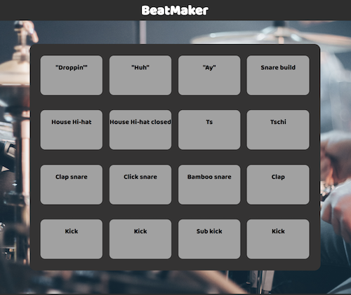
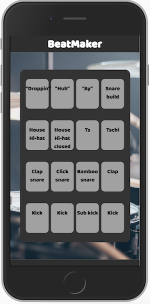

# BeatMaker
A quick side project, building a virtual drum machine.

- This was a fun to build side project that I will continue adding to as I gain more skills. 
- I definitely enjoyed the styling side of things, putting together the look of the machine. 
- The JavaScript so far is quite simple, just two functions to add the sound-playing functionality and the color/ size effects.

## Future Additions

- Adding a database of sounds to choose from, to make it possible to put together the machine yourself.
- Ability to record sequences and add to them.
- Record and export beats.